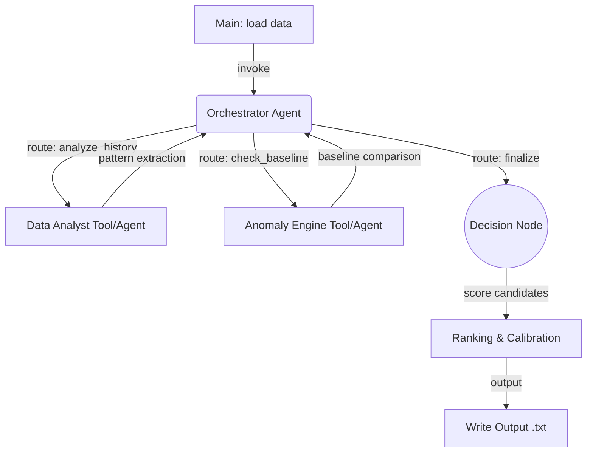
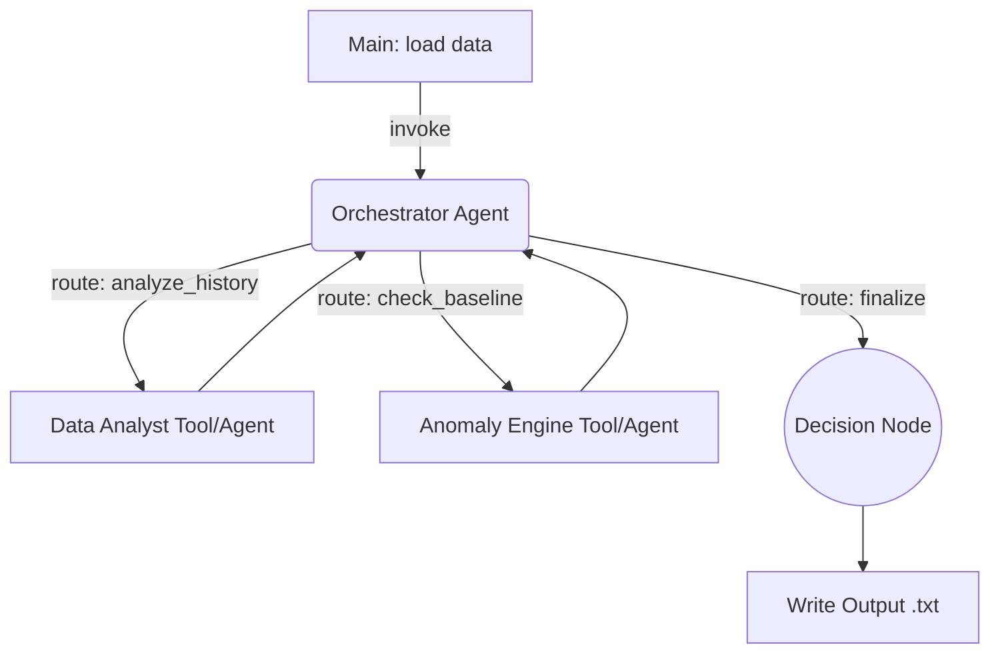

# Implementation - Reply Code Challenge 2026

## Status: COMPLETED ✓

**Final Ranking:** 57 / 2000 teams (Top 3%)

This folder contains the production solution implemented during the 6-hour challenge on April 16th, 2026.
The complete submitted source code is in [01_Implementation_Code/](01_Implementation_Code/) organized by dataset.

---

## Final Architecture

The implemented solution uses a **ReAct-based multi-agent orchestrator** with the following components:



**Implementation Details:**
- **Primary Model:** `meta-llama/llama-3.1-8b-instruct` (Llama 3.1 8B, cost-optimized)
- **Temperature:** 0.1 (deterministic outputs)
- **Integration:** Langfuse for session tracking and observability, OpenRouter for API access
- **Optimization:** Adaptive recursion limits (70-120 based on dataset size), fallback error handling, second-pass review for uncertain cases

---

## Key Implementation Decisions

### 1. Heuristic + LLM Hybrid Approach
- Initial heuristic scoring (z-score based, balance impact, payment pattern anomalies)
- LLM validation and context-aware reasoning for final classification
- Second-pass LLM review for borderline/disputed cases

### 2. Parameter Optimization (Achieved during challenge)
| Parameter | Optimization | Rationale |
|-----------|--------------|-----------|
| Recursion Limit | 90 → 70 (≤600 txns) | Reduce token overhead while maintaining depth |
| Max Tokens | 1800 → 1200 | More concise outputs without losing quality |
| Z-Score Threshold | 3.0 → 3.5 | Stronger outlier detection |
| Fallback Models | 3 → 1 | Reduce failure cost and cascade |
| Retry Policy | max_retries=2 → 0 | Deterministic behavior under token constraints |

### 3. Economic-Aware Detection
- Balance-drop scorer: flags transactions causing >50% balance drops
- High-value fraud prioritization: calibration ranks top-6 transactions over static thresholds
- Monthly salary-aware thresholds: adapts to individual spending patterns

### 4. False Positive Reduction
- Explicit legitimate pattern whitelist: recurring salary, utilities, subscriptions
- Accent-normalized entity linking (NFKD) for consistent name matching
- Conservative expansion heuristics with adaptive bounds

---

## Final Submitted Solution

The complete submitted source code is organized by dataset in [01_Implementation_Code/](01_Implementation_Code/):

```
01_Implementation_Code/
  Dataset1_Implementation/  - Submission for Dataset 1
  Dataset2_Implementation/  - Submission for Dataset 2
  Dataset3_Implementation/  - Submission for Dataset 3
  Dataset4_Implementation/  - Submission for Dataset 4
  Dataset5_Implementation/  - Submission for Dataset 5
```

Each dataset implementation includes:
- Complete agentic system code with orchestrator, tools, and LLM integration
- CLI entry point with argument parsing and output formatting
- All dependencies and configuration files
- Reproduction instructions

---

## Run Instructions

**From repository root:**
```bash
# Activate environment
source .venv/bin/activate

# Run submission for any dataset
cd 02_AI_Agents_Challenge/01_Implementation/01_Implementation_Code/Dataset1_Implementation/
python main.py --model meta-llama/llama-3.1-8b-instruct --output predictions.txt
```

**Configuration:** Uses root `.env` file with:
- `OPENROUTER_API_KEY` - API access
- `LANGFUSE_PUBLIC_KEY`, `LANGFUSE_SECRET_KEY`, `LANGFUSE_HOST` - Observability
- `TEAM_NAME` - Session ID prefix

---

## Architecture Blueprint (Original Design)

Based on sandbox training, this was the intended architecture to implement:



**Key components:**
- **Model:** `meta-llama/llama-3.1-8b-instruct` (or whichever proved best in sandbox)
- **Temperature:** `0.1`
- **Pattern:** ReAct orchestrator breaking down the task, calling a pure Python `compare_baseline()` tool to compare the `personas.md` text against the `status.csv` metrics.

---

## Suggested structure

```
01_Implementation/
  README.md           - Architecture notes and run instructions
  main.py             - Entry point: LangGraph compile(), input feeding, output writing
  graph.py            - LangGraph node definitions and edge routing
  tools.py            - Analysis tools (e.g. bio-index trend calculator)
  utils.py            - (Symlink or copy of .scripts/utils.py for dataset loading)
```

Credentials: use the root .env file (one level above 02_AI_Agents_Challenge). Do not create a local .env here.
Dependencies: the root .venv already contains everything. Activate it with `source ../../.venv/bin/activate` or run `make` from the repo root if not yet set up.

---

## Lessons & References

### Challenge Rules & API Documentation

These files contain the official competition requirements:

1. [../00_How_It_Works/README.md](../00_How_It_Works/README.md) - Competition rules, timeline, scoring criteria, dataset unlock conditions
2. [../00_How_It_Works/api_guidelines.md](../00_How_It_Works/api_guidelines.md) - Langfuse integration patterns, session ID generation, cost monitoring best practices
3. [../00_How_It_Works/model_whitelist.md](../00_How_It_Works/model_whitelist.md) - OpenRouter model IDs and cost estimates
4. [../00_How_It_Works/submission_guide.md](../00_How_It_Works/submission_guide.md) - Submission workflow and failure troubleshooting

### Problem Statement

The official problem statement (`AIAgentChallenge-ProblemStatement16April.md` / `.pdf`) describes:
- **Scenario:** Reply Mirror - a futuristic financial system where fraud patterns constantly evolve
- **Task:** Design an AI agent system to detect anomalous transactions while balancing accuracy, cost, and latency
- **Scoring:** Weighted across detection quality (count & economic accuracy), system performance (cost & latency), and architecture quality
- **Constraints:** $40 token budget for datasets 1-3, $120 for datasets 4-5 (single submission per eval dataset)

---

## Reproducibility & Source Code

**To reproduce the solution:**

1. Clone the repository and install dependencies:
   ```bash
   cd AI_Agents_Reply_Challenge
   make
   cp .env.example .env
   # Edit .env with your OpenRouter and Langfuse credentials
   ```

2. Run any dataset implementation:
   ```bash
   cd 02_AI_Agents_Challenge/01_Implementation/01_Implementation_Code/Dataset1_Implementation/
   python main.py --model meta-llama/llama-3.1-8b-instruct
   ```

3. View source code:
   ```bash
   # Full implementation for each dataset is in 01_Implementation_Code/
   ls 02_AI_Agents_Challenge/01_Implementation/01_Implementation_Code/
   ```

**Code organization:**
- Agentic orchestrator and decision logic in each Dataset*_Implementation/ folder
- Heuristic & LLM decision engines
- Calibration and output selection logic

---

## Challenge Outcome

- **Rank:** 57 / 2000 teams (Top 3%)
- **Approach:** Hybrid heuristic + LLM with multi-pass review
- **Key Success Factor:** Systematic parameter optimization balancing quality, cost, and reliability
- **Innovation:** Economic-aware risk scoring, accent-normalized entity linking, adaptive calibration bounds

---

## Notes for Future Iterations

1. Multi-agent debate/voting could further improve precision on borderline cases
2. Caching citizen snapshots would reduce redundant LLM calls during iteration
3. Prompt variants with A/B testing could optimize for specific dataset characteristics
4. Real-time budget monitoring via Langfuse API could enable dynamic model selection
